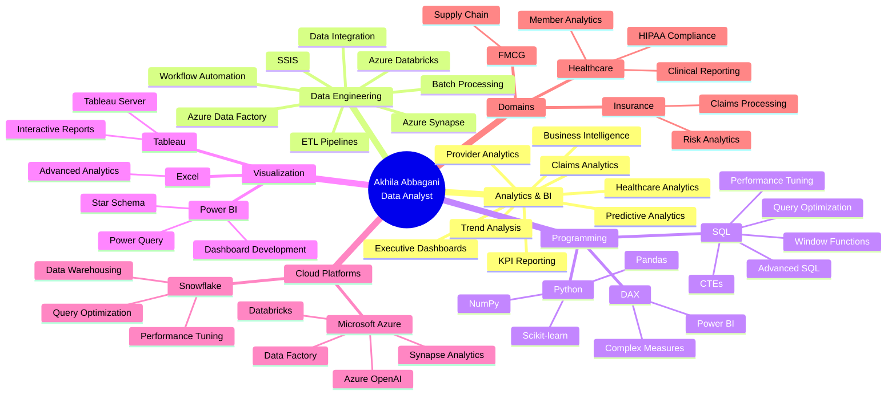

<!-- 
████████╗██╗  ██╗███████╗    ███████╗██╗   ██╗████████╗██╗   ██╗██████╗ ███████╗
╚══██╔══╝██║  ██║██╔════╝    ██╔════╝██║   ██║╚══██╔══╝██║   ██║██╔══██╗██╔════╝
   ██║   ███████║█████╗      █████╗  ██║   ██║   ██║   ██║   ██║██████╔╝█████╗  
   ██║   ██╔══██║██╔══╝      ██╔══╝  ██║   ██║   ██║   ██║   ██║██╔══██╗██╔══╝  
   ██║   ██║  ██║███████╗    ██║     ╚██████╔╝   ██║   ╚██████╔╝██║  ██║███████╗
   ╚═╝   ╚═╝  ╚═╝╚══════╝    ╚═╝      ╚═════╝    ╚═╝    ╚═════╝ ╚═╝  ╚═╝╚══════╝
-->

<div align="center">

</div>

<div align="center">

</div>

<br/>

```bash
┌─[akhila@analytics-terminal]─[~/professional_profile]
└──╼ $ whoami
Akhila Abbagani • Data Analyst • Healthcare & Insurance Analytics Specialist

┌─[akhila@analytics-terminal]─[~/career_metrics]
└──╼ $ ls -la achievements/
drwxr-xr-x  3+ years of enterprise analytics experience
drwxr-xr-x  12M+ healthcare claim records processed
-rw-r--r--  40% improvement in reporting efficiency
-rw-r--r--  2.8TB daily data pipeline automation
-rw-r--r--  99.8% pipeline reliability achieved
-rw-r--r--  250+ business users supported
-rw-r--r--  48% query performance optimization

┌─[akhila@analytics-terminal]─[~/current_focus]
└──╼ $ cat mission.txt
Building scalable data solutions that transform complex healthcare data
into actionable business intelligence through advanced analytics and
cloud-based architectures.
```

<br/>

<table align="center">
<tr>
<td></td>
<td></td>
<td></td>
</tr>
</table>

<div align="center">

[](https://github.com/akhila0920)
[](https://linkedin.com)
[](https://github.com/akhila0920)


</div>

<br/>

## 🎯 Professional Identity

<table width="100%">
<tr>
<td width="50%" valign="top">

```typescript
class DataAnalyst implements Expert {
  private identity = {
    name: "Akhila Abbagani",
    title: "Data Analyst",
    location: "Lees Summit, MO",
    experience: "3+ years"
  };

  private expertise: TechStack = {
    languages: [
      "Python", "SQL", "DAX"
    ],
    analytics: [
      "Business Intelligence",
      "Healthcare Analytics",
      "Predictive Analytics",
      "Statistical Analysis"
    ],
    visualization: [
      "Power BI", "Tableau",
      "Executive Dashboards"
    ]
  };
}
```

</td>
<td width="50%" valign="top">

```python
class CloudDataEngineer:
    def __init__(self):
        self.cloud_platforms = {
            'azure': [
                'Azure Databricks',
                'Azure Data Factory',
                'Azure Synapse Analytics',
                'Azure OpenAI'
            ],
            'databases': [
                'Snowflake', 'SQL Server',
                'PostgreSQL'
            ],
            'etl_tools': [
                'SSIS', 'ADF Pipelines',
                'Spark Streaming'
            ]
        }
        
    def build_solutions(self):
        return "Scalable data pipelines"
```

</td>
</tr>
</table>

<br/>

## 📊 Impact Metrics Dashboard

```python
achievement_matrix = {
    'professional_experience': {
        'total_years': 3.5,
        'companies': ['Cigna', 'Cognizant'],
        'domains': ['Healthcare', 'Insurance', 'FMCG']
    },
    'data_engineering_impact': {
        'records_processed': '12M+ healthcare claims',
        'daily_data_volume': '2.8 TB automated',
        'pipeline_reliability': '99.8%',
        'refresh_time_reduction': '38%'
    },
    'business_intelligence_metrics': {
        'reporting_efficiency': '40% improvement',
        'dashboard_users': '250+ business users',
        'query_optimization': '48% faster',
        'manual_effort_saved': '32 hours/month'
    },
    'technical_achievements': {
        'query_performance': '18 min → 7 min',
        'data_accuracy': '99.5%',
        'reporting_discrepancies': '42% reduction',
        'forecasting_accuracy': '18% improvement'
    }
}

print(f"Total Impact: Enterprise-scale healthcare analytics transformation")
```

<table align="center">
<tr>
<td align="center"></td>
<td align="center"></td>
<td align="center"></td>
<td align="center"></td>
</tr>
</table>

<br/>

## 💡 About Me

I am a **Data Analyst** with over **3 years of specialized experience** delivering comprehensive analytics, business intelligence, and cloud-based data solutions across **healthcare and insurance domains**. My expertise lies in transforming complex, multi-source data into actionable insights that drive strategic business decisions and operational improvements.

Throughout my career, I have successfully built and optimized **scalable ETL pipelines** processing over **12 million healthcare claim records** and **2.8 TB of daily data**, achieving **99.8% pipeline reliability** while reducing refresh times by **38%**. My work has directly supported **250+ business users** with interactive dashboards and automated reporting solutions that improved efficiency by **40%** and saved **32 hours of manual effort monthly**.

At **Cigna**, I pioneered AI-assisted healthcare reporting solutions using **Azure OpenAI**, **Python**, and **Power BI**, which reduced monthly reporting effort by **32 hours** while significantly improving analyst productivity. I designed executive dashboards using advanced **DAX**, **SQL CTEs**, **Window Functions**, and **Azure Synapse Analytics** to monitor claims, provider performance, and operational KPIs. My optimization work with **Snowflake SQL** reduced dashboard refresh times from **18 minutes to under 7 minutes**, dramatically improving user experience.

During my tenure at **Cognizant**, I developed interactive **Power BI** and **Tableau** dashboards using **Star Schema modeling** and **Power Query** that reduced reporting time from **two days to six hours**. I performed extensive exploratory data analysis and statistical validation using **Python**, **Pandas**, and **NumPy**, improving forecasting accuracy by **18%**. My SQL performance optimization work, including query tuning and indexing strategies, reduced report processing time by **48%** while maintaining **99.5% data accuracy** across all healthcare analytics initiatives.

I am currently pursuing a **Master's in Big Data Analytics and IT** at the **University of Central Missouri** (expected May 2026), building upon my **Bachelor of Technology in Electronics and Computer Engineering**. This advanced education, combined with hands-on experience in **Snowflake**, **Azure Databricks**, **Azure Data Factory**, and **Azure Synapse Analytics**, positions me to tackle complex data engineering challenges and deliver innovative analytical solutions.

My technical proficiency spans the complete data analytics lifecycle: from **data extraction and transformation** using **SQL** and **Python**, to **dimensional modeling** and **data warehousing** with **Snowflake**, to **visualization and storytelling** through **Power BI** and **Tableau**. I am passionate about leveraging **machine learning**, **predictive analytics**, and **AI-assisted tools** to unlock deeper insights and drive continuous improvement in data-driven organizations.

<br/>



<br/>

## 💼 Professional Experience

<table width="100%">
<tr>
<td width="50%" valign="top">

### 🚀 Data Analyst
**`Cigna • Remote • Oct 2025 – Apr 2026`**

  

**Enterprise Healthcare Data Solutions**

- Built **enterprise healthcare datasets** using **SQL**, **Snowflake**, **Azure Databricks**, and **Python** by integrating claims, eligibility, provider, and member data, supporting analytics across **12M+ claim records** and improving reporting efficiency by **40%**

- Developed **AI-assisted reporting solutions** with **Azure OpenAI**, **Python**, **Power BI**, and **Tableau** to generate automated healthcare summaries, reducing monthly reporting effort by **32 hours** while improving analyst productivity

- Designed **executive dashboards** in **Power BI** and **Tableau** using **DAX**, advanced **SQL**, **CTEs**, **Window Functions**, and **Azure Synapse** to monitor claims, provider performance, and operational KPIs for more than **250 business users**

- Automated **ETL workflows** using **Azure Data Factory**, **Azure Databricks**, **Python**, and **SQL** to validate and process **2.8 TB of healthcare data daily**, reducing refresh time by **38%** while maintaining **99.8% pipeline reliability**

- Prepared **analytical datasets** for healthcare risk and utilization analysis using **Python**, **Scikit-learn**, **SQL Views**, and feature engineering, enabling faster model development and improving data readiness by **35%**

- Worked closely with clinical teams, product owners, and data engineers to implement **HIPAA-compliant** data validation, governance standards, and metadata management, reducing reporting discrepancies by **42%**

- Optimized **Snowflake SQL** using **CTEs**, **Window Functions**, clustering, indexing strategies, and query tuning to reduce dashboard refresh time from **18 minutes to under 7 minutes** and improve overall user experience

**Technology Stack:**
```yaml
Backend: SQL • Snowflake • Azure Databricks
Frontend: Power BI • Tableau • DAX
AI/ML: Azure OpenAI • Python • Scikit-learn
Cloud: Azure Synapse • Azure Data Factory
```

</td>
<td width="50%" valign="top">

### 🏢 Data Analyst
**`Cognizant • Remote • Apr 2021 – Jun 2024`**

  

**Multi-Domain Analytics & Data Engineering**

- Analyzed **large business datasets** using **SQL**, **Python**, **Power BI**, **Tableau**, and **Excel** to identify operational trends and deliver insights across multiple healthcare and insurance projects, reducing manual reporting by **35%**

- Built **scalable ETL pipelines** with **Azure Data Factory**, **SSIS**, **Snowflake**,